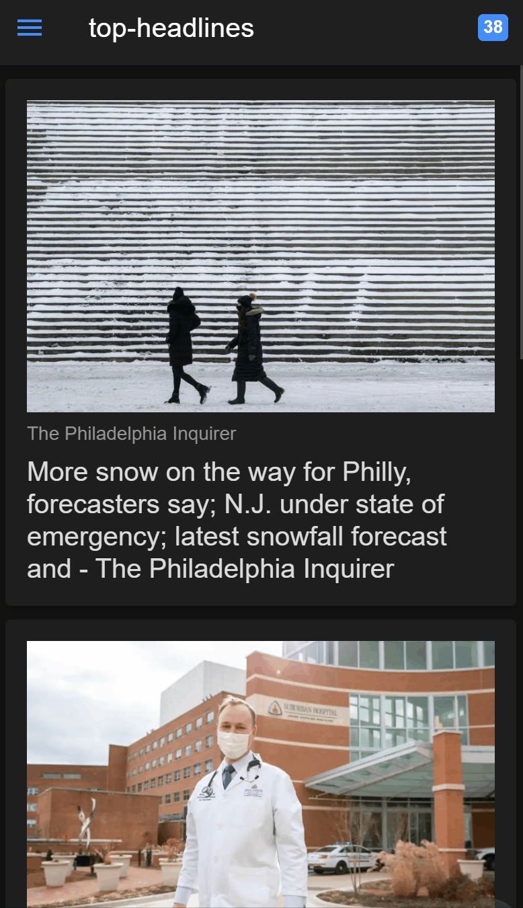

# NewsApp

This is a news app build during the [#100daysofcode](https://github.com/schmelto/100-days-of-code/) challange of [@schmelto](https://github.com/schmelto).




## Architecture

The app get the news by the NewsAPI from https://newsapi.org/ and showig them in an Ionic Angular Web Application or as a compiled android app.

## How to start

To run the application on your computer clone the repository to your local machine and run following commands:
(Prerequisite: [Node.js](https://nodejs.org/en/) and Ionic)
```
npm install
```

To install Ionic run:
```
npm install -g @ionic/cli
```

To start the app go into te `app`-folder and run:
```
ionic serve
```

This should open the website in your default browser with the URL http://localhost:8100/

To run on your andorid device get the APK-file and install it on your phone. You should enable installing external apps (apk).

## More Information

to deploy to IOS or Android: https://ionicframework.com/docs/angular/your-first-app/6-deploying-mobile


